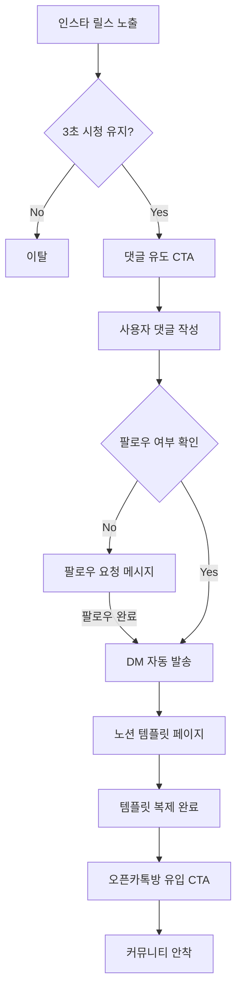

# 🏴 벙커(BUNKER) x 📝 꼼꼼이 — 인스터 릴스 전환 퍼널 케이스 01

---
@file        STRATEGY.md
@version     v1.0.0
@updated     2026-03-14
@agent       꼼꼼이 (Docs Lead)
@ordered-by  용남 대표
@description 인스타그램 릴스를 활용한 노션 템플릿 배포 및 오픈카톡 유입 최적화 퍼널 (Case 01)
---

## 1. 퍼널 개요 (Funnel Overview)

본 전략은 인스타그램의 알고리즘과 외부 서비스(Notion, Kakao)를 연결하여 시청자를 가망 고객으로 전환하는 가장 검증된 'Case 01' 흐름을 정의합니다.

### 전환 흐름도 (Flow Chart)

---

## 2. 단계별 상세 지침

### PHASE 1. 릴스 기획 (The Bait)
- **후킹 (0~3s)**: "아직도 수기로 하나요? 10초 만에 끝내는 법" (결과 중심의 강렬한 문구)
- **정보 제공 (3~15s)**: 노션 템플릿이 작동하는 영상 시연. 사용자가 얻을 이익 실각화.
- **클로징 (15~20s)**: "댓글로 '신청' 남기면 템플릿 DM으로 바로 쏴드려요!"

### PHASE 2. 자동화 트리거 (The Trap)
- **ManyChat / DM 자동화 설정**:
  - 키워드: `신청`, `노션`, `비밀`
  - 답글: "방금 DM으로 링크 보내드렸습니다! 확인해 보세요! 🔥"
  - DM 내용: "템플릿 신청해 주셔서 감사합니다! (팔로우 확인 후) 링크 클릭해서 복제해 가세요!"

### PHASE 3. 보상 제공 (The Reward)
- **노션 페이지 구성**:
  - 상단: 템플릿 활용 가이드 (YouTube/Gif)
  - 중앙: [복제하기] 버튼
  - 하단: "혼자 하기 어려우신가요? 오픈카톡방에서 같이 고민해요!" (버튼)

### PHASE 4. 커뮤니티 장착 (The Retention)
- **오픈카톡방 유도**: 
  - 템플릿 안에 숨겨진 '치트키'나 '추가 자료'를 오픈카톡방 공지사항에 기재하여 유입 유도.

---

## 3. 핵심 수치 (Metrics)
| 지표 | 목표 | 비고 |
| :--- | :--- | :--- |
| **Hook Rate** | 30% 이상 | 첫 3초 시청 비율 |
| **Comment Conv.** | 5% 이상 | 시청수 대비 댓글 수 |
| **Follow Conv.** | 2% 이상 | 도달 대비 팔로워 증가 수 |
| **Community In** | 20% 이상 | 템플릿 다운로드 대비 카톡방 가입 수 |

---

## 4. 실행 체크리스트
- [ ] 노션 템플릿 복제 허용 설정 확인
- [ ] 매니챗 채널 연결 및 키워드 작동 테스트
- [ ] 오픈카톡방 봇/PW 설정 완료
- [ ] 릴스 캡션 내 해시태그 최적화

---
**변경 이력**
- 2026-03-14 | v1.0.0 | 최초 생성 (꼼꼼이)
